# Mapa mental y auditoría general — Vision Rover Challenge

> Auditoría documental y estática realizada el 12 de septiembre de 2026 sobre
> `main` en `cb66591`. No sustituye una prueba de cancha con los dos rovers
> físicos, la cámara y la red oficial.

## Mapa mental

```mermaid
flowchart TD
    A[Vision Rover Challenge] --> B[Meta de competencia]
    B --> B1[Dos CenfoBots autónomos]
    B --> B2[Clasificar, mover y depositar cubos]
    B --> B3[Más cubos correctos en menor tiempo]

    A --> C[Reglas y límites]
    C --> C1[Sin modificaciones físicas]
    C --> C2[Sin control humano durante la ronda]
    C --> C3[Decisión y control en los rovers]
    C --> C4[Usar estado reciente de telemetría]

    A --> D[Cancha y percepción oficial]
    D --> D1[Cancha lógica 43 × 43 celdas · 20 mm]
    D --> D2[4 ArUco de esquina + ArUco 10 y 11]
    D --> D3[Cámara cenital y visión]
    D --> D4[TCP + NDJSON · protocolo v2]
    D --> D5[Poses, cubos por color, depósitos y fase]

    A --> E[Solución que construye cada equipo]
    E --> E1[Cliente de telemetría]
    E --> E2[Modelo local y filtro de datos viejos]
    E --> E3[Asignación de cubos entre rovers]
    E --> E4[Planificación y prevención de colisiones]
    E --> E5[Control diferencial y corrección con sensores]
    E --> E6[Comunicación rover ↔ rover]

    A --> F[Robot y software de referencia]
    F --> F1[ESP32 IdeaBoard + CircuitPython/C/C++]
    F --> F2[Motores, IR, ultrasonido, color, IMU]
    F --> F3[Ejemplos: motores, PID, giros, ESP-NOW]
    F --> F4[No hay todavía controlador autónomo integrado]

    A --> G[Operación]
    G --> G1[Montar cancha y marcadores]
    G --> G2[Calibrar y medir cámara]
    G --> G3[READY automático → RUNNING]
    G --> G4[Hasta 600 s configurados]
    G --> G5[Acta y cierre por éxito, tiempo o seguridad]
```

## Lectura ejecutiva

El proyecto tiene dos productos distintos:

1. La **infraestructura oficial** —reglamento, cancha, visión, contrato y
   operación— está bien delimitada y presenta una base técnica sólida.
2. La **solución competidora** —software que vive en los dos ESP32 y convierte
   telemetría en decisiones, movimiento y coordinación— todavía no está
   integrada en este repositorio. Los archivos de `codigos/` son componentes y
   ejemplos, no una estrategia de ronda ejecutable de punta a punta.

Por tanto, la principal brecha no es de percepción: es de autonomía embarcada,
integración y validación física.

## Alcance y evidencia revisada

| Área | Evidencia | Resultado |
| --- | --- | --- |
| Reglas y objetivo | `reglamento.md`, `el_reto.md`, `robot.md` | Reglas de autonomía y responsabilidades claras. |
| Visión | `vision-system/vision/` y configuración | Arquitectura separada en captura, geometría, detección, seguimiento, reglas y publicación. |
| Contrato | `vision-system/contrato/` | TCP/NDJSON v2, esquema, simulador y cliente de referencia. |
| Operación | `MONTAJE.md`, `PUESTA_A_PUNTO.md`, `OPERACION.md` | Procedimientos completos de cancha, cámara y ronda. |
| Rover | `codigos/`, `programacion/`, `armado/`, `conexiones/` | Material base y ejemplos, sin aplicación competidora integrada. |

### Comprobaciones ejecutadas

Todas terminaron en **TODO OK**:

- `python3 -m vision.tools.verificar_config`
- `verificar_geometria`, `verificar_rovers`, `verificar_cubos` y
  `verificar_seguimiento`
- `verificar_acopio`, `verificar_ronda` y `verificar_ejemplos`
- Compilación estática: `python3 -m compileall -q codigos vision-system/contrato vision-system/vision`

Las validaciones sintéticas confirman geometría, poses, cubos, oclusión,
acopio, fases y ejemplos documentados. No prueban los motores, la red de la
competencia, el montaje final ni la interacción física con cubos.

## Estado por área

| Área | Estado | Observación de auditoría |
| --- | --- | --- |
| Reglamento | Verde | Define con claridad qué está permitido; la autonomía reside en los rovers. |
| Contrato de telemetría | Verde | Versionado, validable y acompañado por simulador/cliente; es la interfaz correcta para equipos. |
| Visión y arbitraje | Verde con cierre físico pendiente | Las verificaciones pasan; falta confirmar las medidas señaladas como provisionales en cancha definitiva. |
| Cancha y cámara | Ámbar | Requiere montaje exacto, perfil de cámara y prueba de precisión antes de competir. |
| Código de rover | Ámbar/Rojo | Hay buenas piezas aisladas, pero no cliente de telemetría, planificador, coordinador ni lazo de control de competición integrado. |
| Documentación raíz | Ámbar | Es útil como puerta de entrada, pero necesita consolidar el recorrido de un equipo competidor. |

## Hallazgos priorizados

| Prioridad | Hallazgo | Impacto | Acción recomendada |
| --- | --- | --- | --- |
| P0 | No existe una aplicación autónoma integrada para los dos ESP32. | No se puede competir solamente con los ejemplos. | Crear un paquete/ejemplo de referencia que conecte telemetría → decisión local → control → coordinación. |
| P0 | No hay prueba extremo a extremo con hardware real en la auditoría. | Riesgo de fallos de motores, latencia, Wi‑Fi/ESP‑NOW, batería y empuje. | Ejecutar una prueba de ronda por etapas y registrar métricas/actas. |
| P1 | El desfase posicional marcador→centro del rover figura pendiente de medir en `config_vision.json`. | Error sistemático de navegación, aunque el valor actual se estima menor a 10 mm. | Medir giro sobre el eje para cada rover y guardar/aplicar el resultado. |
| P1 | Las mediciones definitivas de cámara/cancha dependen del montaje final. | La precisión sintética no garantiza precisión operativa. | Seguir `PUESTA_A_PUNTO.md`, medir precisión y conservar los perfiles de la cámara elegida. |
| P1 | `command_protocol.py` usa `COMANDO|...`, mientras `wifi_command_receiver.py` analiza comandos separados por espacios y solo implementa una parte. | Si se conectan directamente, comandos válidos del protocolo no se ejecutarán. | Unificar protocolo/receiver, añadir pruebas de compatibilidad y señalar cuáles ejemplos son alternativos. |
| P1 | El ejemplo `wifi_command_receiver.py` permite control TCP desde una computadora. | Es válido para desarrollo, pero sería antirreglamentario durante una ronda si esa computadora decide o manda movimiento. | Marcarlo explícitamente como herramienta de laboratorio; el controlador oficial debe residir en el ESP32. |
| P2 | El README raíz enlaza `Vision-Robotic-Challenge` para `robot.md`. | Enlace potencialmente roto o dirigido a otro repositorio. | Corregirlo a `Vision-Rover-Challenge`. |
| P2 | El entorno virtual documentado (`vision-system/.venv`) no está presente en este checkout. | Menor reproducibilidad para quien quiera ejecutar las herramientas tal como están documentadas. | Añadir instrucciones de bootstrap o un script de instalación; no versionar el entorno. |
| P2 | La grabación para reproducir sesiones sin cámara sigue planificada. | Diagnóstico post-ronda y regresión más lentos. | Priorizarla después del controlador embarcado y la validación física. |

## Riesgos de competición que el controlador debe tratar

- Consumir únicamente el mensaje más reciente; usar `seq`, `ts_ms` y `age_ms`.
- Detener o degradar navegación cuando la pose/cubo esté viejo; una oclusión no
  equivale a una posición nueva.
- Leer `grid`, `start`, `depots`, `depot_size` y `cube_side` del mensaje: no
  codificar una cancha ni colores de depósito fijos.
- Coordinar exclusión de zonas, cubos y rutas entre los dos rovers, con una
  política de recuperación ante pérdida de mensajes entre ellos.
- Separar el control local de seguridad (IR/ultrasonido, watchdog y parada) de
  la estrategia global basada en visión.
- Depositar el cubo completamente dentro de la zona y sostenerlo: el árbitro
  exige 1 s de permanencia configurada antes de contarlo.

## Ruta mínima hacia una ronda confiable

1. Implementar en cada ESP32 un cliente robusto del contrato v2 y un watchdog.
2. Definir un protocolo entre rovers: identidad, tarea, reserva, progreso,
   latido y liberación por fallo.
3. Integrar una máquina de estados: esperar → elegir cubo → aproximar → empujar
   → verificar depósito → recuperar/ceder → finalizar.
4. Añadir un planificador discreto de cuadrícula con reserva de celdas o una
   prioridad determinista para evitar encuentros frontales.
5. Probar primero con `mock_publisher.py`, después con un rover, luego dos
   rovers sin cubos, con cubos y finalmente con una ronda completa.
6. Cerrar calibración, desfases y una lista de verificación pre-ronda.

## Criterio de salida de auditoría

El proyecto quedará listo para una demostración competitiva cuando se cumplan
simultáneamente: dos rovers reciben telemetría v2 real, cada decisión se toma
en sus ESP32, completan una ronda sin intervención humana, no colisionan,
depositan cubos con el criterio del árbitro y la cámara/cancha definitiva pasa
las mediciones de puesta a punto.
